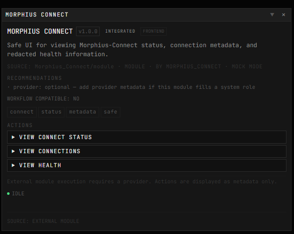

# Morphius Connect

**Private/local connection and secrets layer for Morphius-compatible systems.**

Part of the Morphius ecosystem: [Morphius](https://github.com/LeventeDaniel/Morphius) · [Morphius Forge](https://github.com/LeventeDaniel/Morphius_Forge) · [Morphius Connect](https://github.com/LeventeDaniel/Morphius_Connect)

---

## Connect module — example

The `module/` folder in this repo is a **sample Connect module** — a non-functional UI example showing what a Morphius module for Connect could look like. It is not wired end-to-end and will not execute real actions. It exists to illustrate the window layout, metadata display, and safe information boundaries (connection types, auth modes, health status — no secret values ever shown).

<p align="center">
  
</p>

---

## What is Morphius Connect?

Morphius Connect is a general-purpose private connector and configuration layer. It provides a safe, external place for API endpoints, credentials, runtime rules, and adapter configuration — values that must never live in a public repository.

It is:

- A **private config layer** for Morphius-compatible systems
- A **secrets resolver** that reads from `.env` / environment variables
- A **connection validator** that checks schema and safety at build/startup
- A **health checker** that pings configured endpoints
- A **policy evaluator** that enforces runtime approval rules

It is not:

- Part of Morphius core (the webtop/canvas host)
- Part of Morphius Forge (the module builder kit)
- A public module or published package
- An authentication provider or OAuth server
- A proxy or gateway

---

## Architecture Overview

```
┌─────────────────────────┐
│   Morphius (public)     │  Canvas host, webtop, module runner
└────────────┬────────────┘
             │ requests connection by ID
             ▼
┌─────────────────────────┐
│  Morphius Connect       │  ← You are here (PRIVATE)
│  (this repo, private)   │  Resolves connections, secrets, rules
└────────────┬────────────┘
             │ resolves to real endpoints + headers
             ▼
┌─────────────────────────┐
│  Local or Cloud APIs    │  LLMs, databases, coding APIs, etc.
└─────────────────────────┘

┌─────────────────────────┐
│  Morphius Forge (public) │  Module builder kit
└─────────────────────────┘
  Forge modules request connections by ID — they never embed keys.
```

---

## Why Secrets Live Outside Public Repos

Public repositories are indexed, cached, and visible indefinitely. A secret committed even briefly and then deleted can be recovered from git history, GitHub's cache, or third-party mirrors.

Morphius Connect enforces a clean boundary:

| Lives in public repo | Lives in Morphius Connect |
|---|---|
| Module logic | API endpoint URLs |
| UI components | Bearer tokens |
| Adapter interfaces | API keys |
| Connection type definitions | Database connection strings |
| Example YAML with placeholders | Real `.env` values |

Modules and orchestrators reference connections by **ID** only. They never embed an endpoint or a key.

---

## Quick Start

### 1. Clone or copy this repo privately

```bash
git clone <your-private-fork> morphius-connect
cd morphius-connect
```

### 2. Install dependencies

```bash
npm install
```

### 3. Create your connect config

```bash
cp connect.example.yaml connect.yaml
# Edit connect.yaml with your real base_urls and secret refs
```

### 4. Create your .env file

```bash
cp .env.example .env
# Edit .env with your real API keys and tokens
```

### 5. Validate

```bash
npm run connect:validate
```

### 6. Run doctor (full system check)

```bash
npm run connect:doctor
```

---

## Configuration Files

### `connect.yaml` (gitignored)

Your local connection registry. Each entry has:

| Field | Description |
|---|---|
| `id` | Unique identifier used by modules to request this connection |
| `type` | Connection category (`llm`, `coding`, `browser`, `database`, etc.) |
| `adapter` | How to talk to it (`ollama`, `openai-compatible`, `generic-http`) |
| `base_url` | The real endpoint URL |
| `model` | For LLM connections: which model to use |
| `auth` | Auth mode and secret reference |
| `health` | Optional health check config |
| `approval` | Whether this connection requires explicit approval before use |

**Example:**

```yaml
connections:
  - id: local-llm
    type: llm
    adapter: ollama
    base_url: http://localhost:11434
    model: your-model-name
    auth:
      mode: none
    health:
      enabled: true
      path: /api/tags
```

See `connect.example.yaml` for all connection types and auth modes.

### `rules.yaml` (gitignored)

Runtime policies that govern connection usage:

- **secrets**: redact logs, never store in public repo
- **approvals**: which action categories require user approval
- **network**: localhost/cloud allow/block rules
- **logging**: which headers and env vars to never log

See `rules.example.yaml` for the full schema.

### `.env` (gitignored, never commit)

Real secret values. Referenced from `connect.yaml` via `token_ref`:

```env
CLOUD_LLM_API_KEY=sk-your-real-key-here
CODING_API_TOKEN=your-real-token-here
```

---

## Supported Connection Types

| Type | Examples |
|---|---|
| `llm` | Local Ollama, OpenAI-compatible APIs, Anthropic |
| `reasoning` | Advanced reasoning models |
| `coding` | Local Codex, code execution endpoints |
| `browser` | Playwright, browser automation APIs |
| `preview` | Canvas/preview APIs |
| `database` | PostgreSQL, MySQL, SQLite, Redis |
| `storage` | S3-compatible, object storage |
| `webhook` | Outbound webhook endpoints |
| `generic-api` | Any HTTP/REST API |

## Supported Auth Modes

| Mode | When to use |
|---|---|
| `none` | Public endpoints, localhost with no auth |
| `bearer` | Standard `Authorization: Bearer <token>` |
| `api-key-header` | Custom header like `X-Api-Key` |
| `basic` | HTTP Basic authentication |
| `env-only` | Secret available as env var but not sent as header (e.g., connection strings) |
| `custom-placeholder` | Placeholder for future auth systems (OAuth, mTLS) |

---

## CLI Commands

```bash
npm run connect:validate    # Validate connect.yaml and rules.yaml schema
npm run connect:list        # List connections (IDs, types, auth modes — no secrets)
npm run connect:health      # Ping health endpoints and report status
npm run connect:doctor      # Full diagnostic: git safety, .env, refs, schema
npm run connect:redact-test # Show how the log redactor handles common secret patterns
```

---

## How Modules Should Use Morphius Connect

Modules and orchestrators should **never** hardcode endpoints or credentials.

Instead, they request a connection by ID:

```typescript
import { loadConnectConfig, createAdapter } from 'morphius-connect';

const { config } = loadConnectConfig();
const conn = config.connections.find((c) => c.id === 'local-llm');
if (!conn) throw new Error('local-llm not configured');

const adapter = createAdapter(conn);
const result = await adapter.request({ method: 'POST', path: '/api/generate', body: { ... } });
```

This keeps module code portable and public-safe. The real URL and key stay in `connect.yaml` and `.env`, which live only on the local machine or private deployment.

---

## How to Add a New Connection

1. Open `connect.yaml` (copy from example if needed)
2. Add a new entry:

```yaml
  - id: my-new-service
    type: generic-api
    adapter: generic-http
    base_url: http://localhost:9000
    auth:
      mode: bearer
      token_ref: MY_NEW_SERVICE_TOKEN
    health:
      enabled: true
      path: /health
```

3. Add the secret to `.env`:

```env
MY_NEW_SERVICE_TOKEN=the-real-token
```

4. Run `npm run connect:validate` to confirm.

---

## How Morphius Can Consume This Later

When Morphius core needs to talk to an LLM, coding API, or preview endpoint, it can:

1. Import Morphius Connect as a local package (via `file:../morphius-connect` in `package.json`)
2. Call `loadConnectConfig()` at startup to load the local registry
3. Use `createAdapter(connection)` to get a ready-to-use HTTP client
4. Use `evaluateConnectionUsage(connection, action, rules)` to check approval requirements before executing

No keys ever appear in Morphius's own source. Morphius Forge modules reference connection IDs in their manifests, and Morphius Connect resolves them at runtime.

---

## Safety Properties

- `.env` is `.gitignored` — can never be committed
- `connect.yaml` and `rules.yaml` are `.gitignored` — real values stay local
- All logging passes through `safeLogger` which redacts secrets automatically
- Secret references resolve only from environment variables — never from YAML values
- Health checks return only status codes and timing — no auth headers in output
- `connect:list` shows auth mode and ref name but never the secret value
- `connect:doctor` checks whether refs exist but never reveals their values

---

## Build

```bash
npm run build       # Compile TypeScript → dist/
npm run connect:validate
```

TypeScript target: ES2022, NodeNext module resolution, strict mode.

---

## How Connect Relates to Modules and Providers

Connect is a passive layer. It does not control what modules can load, what types they are, or what permissions they have. It simply resolves connection IDs to real endpoints and secrets.

**Module relationship:**
- A module declares `connectors` (symbolic names) in its manifest
- At runtime, the module requests a connection by name
- Connect resolves that name to a real endpoint + auth headers
- Connect does not decide whether the module is allowed to make the request — that is a policy/approval concern outside Connect's scope

**Provider relationship:**
- A provider module may request connection metadata for modules it proxies
- Connect provides safe adapter instances — not raw secrets
- A provider does not get special access from Connect just because it declares `provider.kind`
- Connect does not know or enforce provider roles

**Security boundary:**
- Connect holds the real secrets
- Morphius frontend never sees secrets — only safe metadata (connection type, auth mode name, health status)
- Module authors never embed secrets — they reference connection IDs in their manifests
- Connect does not decide final security policy — it is a resolver, not a gatekeeper

**Connect does not force module structure.** Modules may use zero, one, or many Connect connections. A module that uses no connections at all is perfectly valid. Modules built without Forge can still use Connect.

---

## Non-Goals

- No UI — CLI only for MVP
- No OAuth implementation — schema supports it for future addition
- No cloud-provider-specific assumptions
- No real credentials or personal endpoints in this repo
- No approval/sandbox/auth system — Connect is a resolver, not a security engine
- Does not determine what modules are allowed to load — that is Morphius's job
